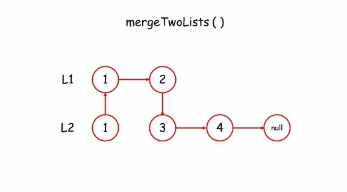
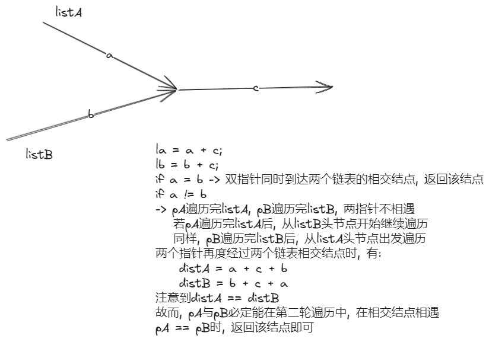

# 链表
> **写在最前**: 以下对链表的所有操作建立在该链表有哑结点的前提下
## 环形链表 141 & 142
### 我的一点想法：
```c
bool hasCycle(struct ListNode *head) {
    bool flag = false;
    struct ListNode* ansList = 
    (struct ListNode*)malloc(sizeof(struct ListNode));
    ansList -> next = NULL;//判重链表dummy node
    struct ListNode* cur = 
    (struct ListNode*)malloc(sizeof(struct ListNode));
    cur -> next = head; //dummy node
    struct ListNode* ansp = ansList; //判重链表循环变量
    struct ListNode* p = ansList; //尾指针，用于尾插法
    while (cur -> next) {
        cur = cur -> next;
        while (ansp -> next) { //在判重链表中寻找有无重复指向的结点
            ansp = ansp -> next;
            if (ansp == cur) return true;
        }
        struct ListNode* s = 
        (struct ListNode*)malloc(sizeof(struct ListNode));
        s -> next = NULL;
        s -> val = cur -> val;
        p -> next = s;
        p = p -> next; //将新结点s插入ansList尾端，更新尾结点
        ansp = ansList; //重置ansp值，使其指向判重链表的头节点
    }
    return false;
}
```
错误原因：超时，具体原因待考察

### 引申知识：弗洛伊德判圈法

**def: 快慢指针在有环的路径中经过有限步迭代一定会在同一点相遇**

再引申:

当快慢指针相遇后，慢指针继续迭代直到回到环的起始点时，若在快慢指针相遇后对head指针进行同步迭代，则head与slow指针一定会在环的起始点相遇

[https://www.bilibili.com/video/BV1KG4y1G7cu/?vd_source=24a80c820080f624a6de7a8a67c62a24](https://)

{ align=center }

## 链表反转 206

### 解法集合

一种比较复杂的做法是建立一个新的链表，遍历原链表并将每一个结点头插到答案链表中，实现链表反转

```c
struct ListNode* reverseList(struct ListNode* head)
{
	struct ListNode* ans = 
	(struct ListNode*)malloc(sizeof(struct ListNode));
	while (head && head -> next) {
		struct ListNode* s = 
		(struct ListNode*)malloc(sizeof(struct ListNode));
		s -> val = head -> val;
		s -> next = ans -> next;
		ans -> next = s; //头插法
		head = head -> next;
	}
	return ans -> next; //不含dummynode
}
```
比较巧妙的办法是利用三指针，单向链表具有不可回溯性，而为了完成链表的反转需要以下步骤：

1. 将当前结点的next指针指向他的前驱结点
2. 更新当前结点与前驱结点，重复1中工作

因为当前结点的next指针指向需要遍历的下一个结点，所以改变next指针时必须用一个指针nxt指向原本next指针指向的内存，这样才能保证当前指针cur的更新有迹可循，同时，由于链表不可回溯，又必须用一个pre指针指向当前结点的前驱结点，则步骤可以描述为：

```
nxt = cur -> next;
cur -> next = pre;
pre = cur;
cur = nxt;
```

这样就完成了相邻链结之间指针的反转，同时保证了pre和cur的可迭代性，下面给出完整代码

### 代码实现
```c
struct ListNode* reverseList(struct ListNode* head) {
	struct ListNOde* pre, * cur, *nxt;
	cur = head;
	pre = NULL; // 初始化cur指向head结点,pre指向NULL(头节点没有前驱) 
	while (cur) { //没有待处理的链结
		nxt = cur -> next; //保存cur -> next
		cur -> next = pre;
		pre = cur;
		cur = nxt;
	}
	return pre;
}
```

## 链表的中间结点 876

我的想法比较粗暴, 就是用一重循环得出链表的结点数, 进而判断链表的中间结点应该出现的位置, 然后再用一重循环扫描出该结点

代码如下:
```c
int Listlength(struct ListNode* head) { //计算长度函数
    int cnt = 0;
    while (head -> next) {
        head = head -> next;
        cnt ++;
    }
    return cnt;
}
struct ListNode* middleNode(struct ListNode* head){
    struct ListNode* s =
     (struct ListNode*)malloc(sizeof(struct ListNode));
    s -> next = head;
    head = s; //dummy node
    int pos = Listlength(head)
    pos = pos / 2 + 1;
    int cnt = 0;
    while (cnt != pos && head -> next) {
        head = head -> next;
        cnt ++;
    }
    return head;
}
```

比较巧妙的做法是利用之前弗洛伊德判圈法所接触的快慢指针, 我们知道, 慢指针每迭代一次前进的长度是一个单位, 而快指针是两个, 所以相对速度上, 快指针每次比慢指针多走一个单位, 在相同时间内, 快指针移动的距离是慢指针的两倍

但这也导致了一个问题,就是在奇数结点的链表上,快指针不会停在最后一个结点, 而是在访问倒数第二个结点后, 快指针最终更新为NULL, 遍历结束, 而偶数结点的链表上fast指针则是指向最后一个结点时结束遍历. 这就导致了慢指针停止的位置不一定正好处于中间结点

不难发现, 奇数结点链表上终止遍历时, 慢指针刚好指向中间结点, 而偶数结点上则是中间结点的前驱, 这就需要一个条件判断语句来对返回值进行选择

### 代码实现

代码实现如下:
```c
struct ListNode* middleNode(struct ListNode* head){
    struct ListNode* s = 
    (struct ListNode*)malloc(sizeof(struct ListNode));
    s -> next = head;
    head = s; //dummy node
    struct ListNode* fast, * slow;
    fast = head;
    slow = head;
    while (fast && fast -> next) {
        fast = fast -> next -> next;
        slow = slow -> next;
    }
    if (fast == NULL) {
        return slow;
    } else {
        return slow -> next;
    }
}
```

**下面给出不含dummy node的链表的findmid操作, 可以省略条件判断语句**

```c
struct ListNode findmidnode(struct ListNode* head) {
    struct ListNode* slow, * fast;
    slow = head;
    fast = head;
    while (fast && fast -> next) {
        fast = fast -> next -> next;
        slow = slow -> next;
    }
    retrun slow;
}
```

## 重排链表 143
## 合并两个有序链表 21
### 我的想法
```c
struct ListNode* mergeTwoLists(struct ListNode* list1, struct ListNode* list2){
    struct ListNode* head1 =
    (struct ListNode*)malloc(sizeof(struct ListNode));
    struct ListNode* head2 = 
    (struct ListNode*)malloc(sizeof(struct ListNode));
    head1 -> next = list1; //list1dummy node
    head2 -> next = list2; //list2dummy node
    struct ListNode* nxt; //后继
    struct ListNode* ans = 
    (struct ListNode*)malloc(sizeof(struct ListNode));
    ans -> next = NULL; //答案链表dummy node
    struct ListNode* p = ans; //尾指针
    while (list1 && list2) {
        if (list1 -> val <= list2 -> val) {
            nxt = list1 -> next;
            head1 -> next = nxt;
            list1 -> next = NULL;
            p -> next = list1;
            p = p -> next;
            list1 = nxt;
        } else {
            nxt = list2 -> next;
            head2 -> next = nxt;
            list2 -> next = NULL;
            p -> next = list2;
            p = p -> next;
            list2 = nxt;
        }
    }
    if (list1) {
        p -> next = list1;
    } else {
        p -> next = list2;
    }
    return ans -> next;
}
```
### 递归实现

原理如下：



```c
struct ListNode* mergeTwoLists(struct ListNode* list1, struct ListNode* list2){
    if (list1 == NULL) return list2;
    else if (list2 == NULL) return list1; //终止条件，一边为空
    else if (list1 -> val < list2 -> val) {
        list1 -> next = mergeTwoLists(list1 -> next, list2);
        return list1;
    } else {
        list2 -> next = mergeTwoLists(list1, list2 -> next);
        return list2;
    }
}
```
主要想清楚**几点问题**就行了
1. 这个问题的子问题是什么
2. 当前层要干什么事情
3. 递归出口

## 排序链表 147 148
在147中, 实现了使用插入排序对链表进行排序的操作, 其基本思路与插入排序相同, 实现的时间复杂度为o($n^2$), 在做题过程中出现了一个小问题, 由于对于循环出口的错误判断导致不完全排序

148在147的基础上对时间复杂度做了进一步要求(o($nlogn$)), 该时间复杂度下的排序算法包括归并排序, 堆排序和快速排序, 其中最适用于链表的是**归并排序**

归并排序基于分治算法, 最容易想到的实现方式是自顶向下的递归实现，考虑到递归调用的栈空间, 自顶向下归并排序的空间复杂度是 $O(log⁡n)$, 如果要达$O(1)$ 的空间复杂度, 则需要使用自底向上的实现方式

### 自顶向下的归并排序
代码实现
```c
struct ListNode* merge(struct ListNode* list1, struct ListNode* list2) {
    if (list1 == NULL) return list2;
    else if (list2 == NULL) return list1;
    else if (list1 -> val < list2 -> val) {
        list1 -> next = merge(list1 -> next, list2);
        return list1;
    } else {
        list2 -> next = merge(list1, list2 -> next);
        return list2;
    }
}
struct ListNode* sortListfunc(struct ListNode* head, struct ListNode* tail) {
    if (head == NULL) {
        return head;
    }
    if (head -> next == tail) {
        head -> next = NULL; //方便后续merge操作
        return head;
    }
    struct ListNode* slow, * fast;
    slow = head; fast = head;
    while (fast != tail && fast) {
        slow = slow -> next;
        fast = fast -> next;
        if (fast != tail && fast) fast = fast -> next;
    }
    struct ListNode* mid = slow;
    return merge(sortListfunc(head, mid), sortListfunc(mid, tail));
}
struct ListNode* sortList(struct ListNode* head) {
    return sortListfunc(head, NULL);
}
```

1. 找到链表的中点，以中点为分界，将链表拆分成两个子链表。寻找链表的中点可以使用快慢指针的做法，快指针每次移动 2 步，慢指针每次移动 1 步，当快指针到达链表末尾时慢指针指向的链表节点即为链表的中点

2. 对两个子链表分别排序

3. 将两个排序后的子链表合并，得到完整的排序后的链表。可以使用「21. 合并两个有序链表」的做法，将两个有序的子链表进行合并

## 相交链表 160
### 什么是哈希表
**哈希表**, 又称为散列表, 是数据存储与查找的一种实现方法

**散列技术是在记录的存储位置和它的关键字之间建立一个确定的对应关系 f 使得每个关键字 key 对应一个存储位置 $f(key)$.** 查找时, 根据这个确定的关系找到给定值 key 的映射 $f(key)$, 若查找集合中存在这个记录, 则必定在 f(key)位置上

我们把这种对应关系称为哈希函数,  将采用散列技术存储记录的一块连续的存储空间称为哈希表, 关键字对应的记录存储位置称为散列地址, **哈希表是面向查找的存储结构**

数据经过哈希映射得出的存入地址可能已经存有数据, 这种情况我们称为**哈希冲突**, 解决方法有开放定址法, 再散列函数法, 链地址法, 公共溢出区法, 详细的内容以后再讨论

在**查找**时，对给定值通过散列函数计算出散列地址后，先与基本表的相应位置进行比对，如果相等，则查找成功；如果不相等，则到溢出表去进行顺序查找。如果相对于基本表而言，有冲突的数据很少的情况下，公共溢出区的结构对查找性能来说还是非常高的

### 题解
#### 我的想法
二重遍历, 对于A表中的每一个结点, 遍历B表结点, 若有相同即位两表交点
代码实现
```c
struct ListNode *getIntersectionNode(struct ListNode *headA, struct ListNode *headB) {
    while (headA) {
        for (struct ListNode* p = headB; p != NULL; p = p -> next) {
            if (headA == p) return headA;
        }
        headA = headA -> next;
    }
    return NULL;
}
```
#### 哈希集合
哈希表的c语言实现详见下文
[[⌈C⌋哈希表UT_hash_handle——如何将结构体类型作为key-CSDN博客]]
代码实现
```c
struct HashTable {
    struct ListNode* key;
    UT_hash_handle hh; //理解为固定参数
};
struct ListNode *getIntersectionNode(struct ListNode *headA, struct ListNode *headB) {
    struct HashTable* hashTable = NULL; //哈希表指针
    struct ListNode* temp = headA;
    while (temp != NULL) {
        struct HashTable* tmp; //指向新创建的键值对
        HASH_FIND(hh, hashTable, &temp, sizeof(struct HashTable*), tmp);
        if (tmp == NULL) {
            tmp = malloc(sizeof(struct HashTable));
            tmp -> key = temp;
            HASH_ADD(hh, hashTable, key, sizeof(struct HashTable*), tmp);
        }
        temp = temp -> next;
    }
    //到这里，已经将headA中的所有结点的存储位置映射在了哈希表里
    temp = headB;
    while (temp != NULL) {
        struct HashTable *tmp;
        HASH_FIND(hh, hashTable, &temp, sizeof(struct HashTable*), tmp);
        if (tmp != NULL) {
            return temp; //temp结点在哈希表中被找到，即为公共结点
        }
        temp = temp -> next;
    }
    return NULL;
}
```
#### 双指针



```c
//我的代码
struct ListNode* getNode(struct ListNode* headA, struct ListNode* headB) {
	struct ListNode* ptrl1, ptrl2;
	ptrl1 = headA;
	ptrl2 = headB;
	while (ptrl1 != ptrl2) {
		if (ptrl1) {
			ptrl1 = ptrl1 -> next;
		} else {
			ptrl1 = headB;
		}
		if (ptrl2) {
			ptrl2 = ptrl2 -> next;
		} else {
			ptrl2 = headB;
		}
	}
	return ptrl1;
}
//题解代码
struct ListNode *getIntersectionNode(struct ListNode *headA, struct ListNode *headB) {
    struct ListNode* ptrl1, * ptrl2;
    ptrl1 = headA;
    ptrl2 = headB;
    while (ptrl1 != ptrl2) {
        ptrl1 = ptrl1 == NULL? headB : ptrl1 -> next;
        ptrl2 = ptrl2 == NULL? headA : ptrl2 -> next;
    }
    return ptrl1;
}
```
## 移除链表元素 203

本题较为简单, 故用作**递归**的练习

我的代码
```c
void deletenode(struct ListNode* head, int val) {
    if (head == NULL) return ;
    if (head -> next && head -> next -> val == val) {
        struct ListNode* s = head -> next;
        head -> next = s -> next;
        free(s);
        deletenode(head, val);
    } else {
        deletenode(head -> next, val);
    }
}
struct ListNode* removeElements(struct ListNode* head, int val) {
    struct ListNode* dummynode = (struct ListNode*)malloc(sizeof(struct ListNode));
    dummynode -> next = head;
    deletenode(dummynode, val);
    return dummynode -> next;
}
```

**递归三问**

1. 这个问题的子问题是什么
	向后删除链表, 不断判断当前结点是否移除

2. 当前层要干什么
	无非就是两件事, 删或不删, 如果前驱的next -> val == val, 需要移除, 若不是则更新前驱继续寻找. **我的程序问题出现在删除这一步**, 需要注意的是, 删除后继结点后, 相当于更新了当前结点的后继结点, 而这个后继结点是未经过程序判断的, 所以, 在下一层递归中, 当前访问的前驱结点不能更新, 否则会导致漏判

3. 程序终止的出口是什么
	由于本题是移除链表元素, 故需要关注当前结点的前驱结点, 在函数中,选择用当前结点的前驱结点作为函数参数, 当前驱结点的后继为空时, 说明链表遍历删除已经结束,  递归应当结束执行