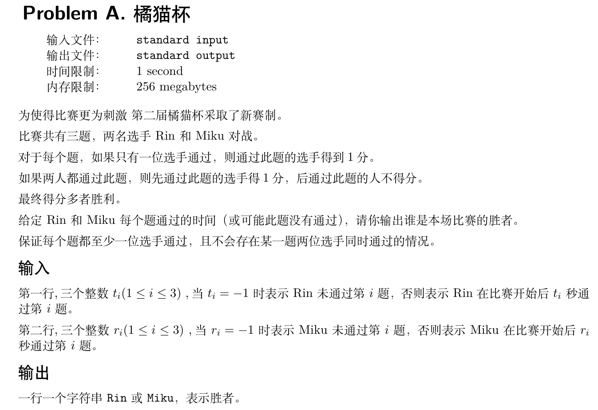
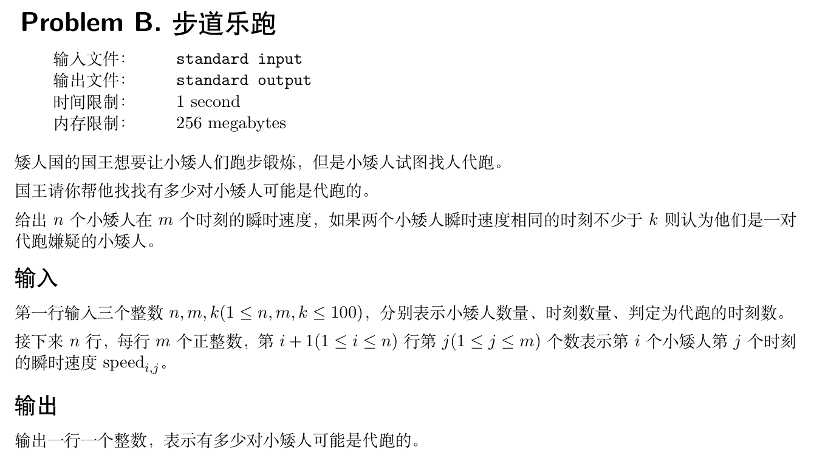
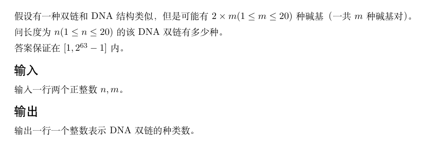
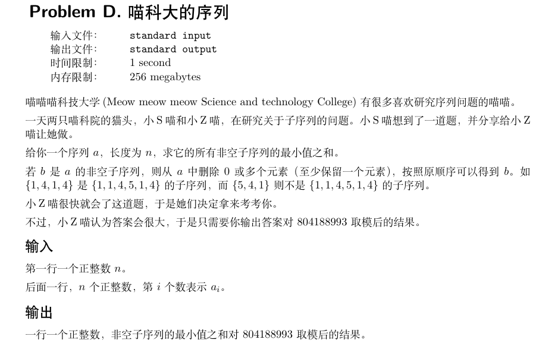

---
authors:
    - mingkun
categories:
    - 碎碎念
    - 程序设计与算法
date: 2024-05-05
tags:
    - ACM - 记录生活
slug:  "2024ACMSummary"
---
# 2024ACM校赛网络赛总结
虽然早有参加比赛的想法，但也一只没有刻意的去做题训练，尤其是从2024年初到现在一直在学习深度学习相关，接触C/C++的时间自然大大减少，现在想想去年竟然能完成到持续近两个月的力扣百题计划，不禁感叹真的是一天不写手生，三个月不写陌生啊（笑），虽然结果不咋样，但还是本着记录生活的心态，做一点小小的总结吧。

<!-- more -->

其实本来应该能拿到比较靠前的名次，不过由于自己没有ACM经历，甚至连赛制都不熟悉，原以为网络赛是在自己确认参赛的时候才开始计时，结果发觉比赛采取统一时钟计时的时候比赛已经过去九十个小时了，虽然也算比较快地做完了前两道签到题A、B，也理所应当地排在了完成两题的队列的尾端，以及虽然在C与D上都做了许多尝试，但最终还是以失败告终，毕竟本来也没有做过刻意的算法训练，做成这样也算是在情理之中吧（笑）。

下面就对我的思路和代码做一些复盘吧，有问题的代码我也贴出来，万一日后大成，回来看看没准就清晰透彻了呢（自嘲）。

## Problem A（AC）
### 题干

### 我的思路
一开始WA了一个提交，因为把题目理解错了，以及真的真的真的对ACM赛制一无所知，在对两个选手做出同一道题的得分判断中，我误将完成该题的用时作为判断依据，也理所应当地出师不利了，其实抛开故事化的题目场景不谈，应该会写for循环和if-else语句的都可以轻松通过。

```C++
#include <bits/stdc++.h>
using namespace std;

int main() {
    int a[3];
    int b[3];
    for (int i = 0; i < 3; i ++) {
        cin >> a[i];
    }
    for (int j = 0; j < 3; j ++) {
        cin >> b[j];
    }
    int cnt1 = 0, cnt2 = 0;
    for (int i = 0; i < 3; i ++) {
        if (a[i] == -1) {
            cnt2 ++;
        } else if (b[i] == -1) {
            cnt1 ++;
        } else if (a[i] < b[i]) {
            cnt1 ++;
        } else {
            cnt2 ++;
        }
    }
    if (cnt1 > cnt2) cout << "Rin" << endl;
    else cout << "Miku" << endl;
    return 0;
}
```

有一种不经过大脑思考的美，单纯的开了两个数组记录用时，两个计数器记录得分，然后扔进for循环里做条件判断，对于当前题目i，如果一方未做出（-1），则另一方得1分，如果双方都做出来，比较当前总花费时长，用时最少的选手得1分，最后比较得分输出结果。

## Problem B（AC）
### 题干

### 我的思路
看到这题我直接笑了，紧跟时事，不得不说乐跑这个政策确实有不合理之处，不过本着随遇而安的性格，也算是能接受，至于代跑，本人一向亲力亲为，自然是不可能找滴。

分析题目，本题难度也不高，接受三个输入，小矮人的数量、时刻数量以及判定为代跑的时刻数，就前两个变量，立刻想到用一个二维数组来存放，行代表小矮人，列代表时刻，判定为代跑的时刻数是作为判定条件的，后续放进条件判断语句就行。

都写到这了，当时也是过题心切，也是直接不费脑子地写了三重暴力循环，现在看来还蛮后悔的，应该有时间复杂度更好的解法。

要求出代跑小矮人的对数，自然而然就想到为其配对，避免重复配对的方法很基础，也不说明了。配对后，对此对数据做差，配速相同时刻超出代跑阈值的视为代跑嫌疑，计数器加一。循环走完后输出结果，一遍通过。

```C++
#include <bits/stdc++.h>
using namespace std;

int main() {
    int n, m, k;
    int data[105][105];
    cin >> n >> m >> k;
    for (int i = 0; i < n; i ++) {
        for (int j = 0; j < m; j ++) {
            cin >> data[i][j];
        }
    }
    int cnt = 0;
    for (int i = 0; i < n; i ++) {
        for (int j = i + 1; j < n; j ++) {
            int cur = 0;
            for (int idx = 0; idx < m; idx ++) {
                if (data[i][idx] - data[j][idx] == 0) {
                    cur ++;
                }
            }
            if (cur >= k) cnt ++;
        }
    }
    cout << cnt << endl;
    return 0;
}
```
> 复盘有感: A, B两题难度都不大，但我是怎么做到解法里透露出一股清澈的愚蠢的\)

## Problem C (WA)
### 题干

### 我的思路
啊，生物，高考赋分88的场景历历在目。依稀记得DNA双螺旋可以理解为双向单螺旋，那么应该存在一定的对称性才对，通过对长度为1、2、3的DNA链进行枚举，发现长度的奇偶性不同，枚举结果的对称性也不同，所以应该分奇偶情况讨论。由于碱基之间存在两两配对的特征，所以枚举单链即可确定整条DNA，我选择从DNA的3'端向5'端枚举，利用排列组合确定枚举种类数，再根据奇偶性进行对应的去重操作。

枚举方法：
$Num_{result} = (C^{1}_{2×m})^n$

注意到奇数长度DNA的枚举结果中，对于每一个枚举单链，一定存在一个与其反向互补的单链，所以直接将奇数长度的DNA除以2完成去重。偶数长度DNA的枚举结果中，注意到对于每一个枚举的单链，如果其对称轴两端碱基可互补配对，则该单链在枚举结果中不会发生重复，除此之外其他形式的单链均存在一个于其反向互补的单链，我选择将对称单链数量翻倍来取得规律统一性，然后将总枚举数量除以2进行去重。

去重方法：
$\begin{cases}
\frac{(C^{1}_{2×m})^n}{2} & \text{m=2×k+1} \\
\frac{{(C^{1}_{2×m})^n+(C^{1}_{2×m})}^{\frac{n}{2}}}{2} & \text{m=2×k} 
\end{cases}$
```C++
#include <bits/stdc++.h>
using namespace std;
int fact(int x) {
    if (x == 1 | x == 0) return 1;
    else return x * fact(x - 1);
}
int select(int n, int m) {
    return fact(m) / (fact(n) * fact(m - n));
}
int main() {
    int n, m;
    cin >> n >> m;
    int h = select(1, m) * 2;
    int h_pow = 1;
    for (int i = 0; i < n; i ++) {
        h_pow *= h;
    }
    if (n % 2 != 0) {
        h_pow /= 2;
    } else {
        int extra = 1;
        for (int i = 0; i < n / 2; i ++) {
            extra *= h;
        }
        h_pow += extra;
        h_pow /= 2;
    }
    cout << h_pow << endl;
    return 0;
}
```

然后WA了，头脑简单的我也不知道为啥QAQ。

## Problem D（WA）
### 题干

### 我的思路
初见此题，没注意到序列的有序性，觉得很简单。读完题就是一顿哐哐敲，存在vector里sort一下，然后纯排列组合，这不数学题嘛，三下五除二敲完，测试样例猛猛对，直接提交，喜提本题第一WA。心想不对，一看题目才发现错的很彻底，推翻重做。既然是有序数据，那么也就意味着一旦确定选择的元素，那么该子集便是唯一的，对于每一个元素，我有选和不选两个选项，当即确定用深搜，开整。

```C++
#include <bits/stdc++.h>
using namespace std;
void dfs(vector<int> subseq, vector<int> seq, int start, int end, int step, long long* sum) {
    if (step == 0) {
        return ;
    }
    for (int i = start; i < end; i ++) {
        subseq.push_back(seq[i]);
        auto result = minmax_element(subseq.begin(), subseq.end());
        * sum += * result.first;
        dfs(subseq, seq, i + 1, end, step - 1, sum);
        subseq.pop_back();
    }
    return ;
}
int main() {
    int n, num;
    cin >> n;
    vector<int> seq;
    for (int i = 0; i < n; i ++) {
        cin >> num;
        seq.push_back(num);
    }
    long long sum = 0;
    vector<int> subseq;
    dfs(subseq, seq, 0, n, n, &sum);
    sum %= 804188993;
    cout << sum << endl;
    return 0;
}
```
> 是的，还是穷举，我没别的招了...

在深搜中，使用两个vector容器，`seq`存放原始序列， `subseq`存放摘出的序列，设定搜索的起始点和终止点，用集合大小指定搜索步数。

在dfs函数中，使用for循环从起始点向终止点遍历。在for循环的每一层，选择一个元素加入`subseq`，并取出当前`subseq`中序列子集的最小值加入`sum`，然后根据序列有序性，以当前加入`subseq`元素的下标加1为新的起始点向后搜索，搜索返回后弹出for循环当前层加入的元素，层数加1。这样保证了在每一步的选择完成后，`subseq`存放的子集是不重复的，同时保证了每一种情况均能枚举到。

最后取模输出，测试样例通过，然后提交提示**运行错误** (NICE)。

我当时的想法是，既然运行错误，那么要么就超时了要么就超内存了。由于我的脑袋比较笨，想不到简化时间的方法，就想着能不能先简化内存，然后再慢慢优化。

在递归里，我每一个堆栈都保留了一个`subseq`的copy，对于数据规模比较大的序列来说无疑是一笔很大的开销。既然对于每一个序列元素，我都有选和不选两个方案，那么我为什么不利用递归同时尝试两个方案呢。

于是我在之前写的dfs的基础上做了大改，添加了布尔选项`choose`，指定当前层元素是否被选择， `idx`指示当前元素下标，不再记录子序列，而是将上次枚举生成子序列的最小值与当前层元素（如果被选中）进行比较，将较小的值加入`sum`。如果当前层没有元素被选中，则子序列未被更新，因此`sum`也不会被更新。完成判断后，当前元素下标自增，对下一个元素进行递归选择。
```C++
#include <bits/stdc++.h>
using namespace std;
void SubSeqMinSum(vector<int> seq, int idx, int min_, long long* sum, bool choose) {
    if (idx >= seq.size()) return ;
    if (choose) {
        min_ = min(seq[idx], min_);
        * sum += (long long)min_;
    }
    idx ++;
    SubSeqMinSum(seq, idx, min_, sum, 0);
    SubSeqMinSum(seq, idx, min_, sum, 1);
    return ;
}
int main() {
    int min_ = INT_MAX;
    int n, num;
    vector<int> seq;
    cin >> n;
    for (int i = 0; i < n; i ++) {
        cin >> num;
        seq.push_back(num);
    }
    long long sum = 0;
    SubSeqMinSum(seq, 0, min_, &sum, 0);
    SubSeqMinSum(seq, 0, min_, &sum, 1);
    sum = sum % 804188993;
    cout << sum << endl;
    return 0;
}
```
内存花费相比前一个方法应该少了很多，虽然但是，还是**运行错误**。调试发现当序列长度大于十五时，递归无法跳出，具体原因因为我调试递归程序的经验和能力有限，也未能查明。

## 写在最后
是的，通过对前四道题的尝试求解让我确定了一件事，C题以后是我无法触及的领域，由于我连题目也没看，就不多做说明了，以后有空会更新题干^^。

挺搞笑的是，写了一天就写出来两道题，还写了这么长的博客来记录。其实我觉得比起挫败感，第一次参加ACM比赛得新鲜感要来的更多。这次比赛让我明白了我的coding能力还有非常大得不足，以后也会在Leetcode上做一些题，希望能有提升吧。

如果你发现了我的解法中存在的问题，欢迎mail我进行嘲笑，但也请附上正确的解法说明，谢谢(doge)。

我的邮箱：mingkun502@gmail.com