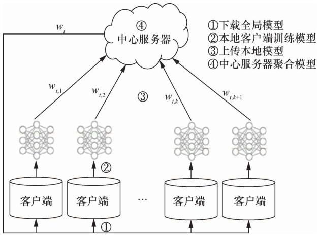
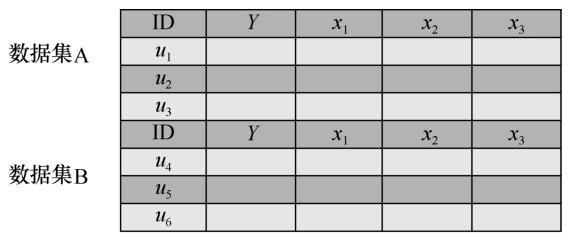
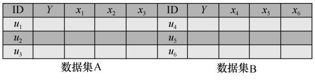
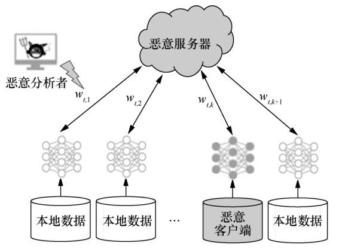

---
authors:
    - mingkun
categories:
    - 深度学习
date: 2024-05-28
tags:
    - Faderated Learning
slug:  "federated-learning"
---
# 联邦学习 | Federated Learning
联邦学习由于能够在多方数据源聚合的场景下协同训练全局最优模型，近年来迅速成为安全机器学习领域的研究热点。

本文归纳了联邦学习定义、算法原理和分类，旨在提供一个对联邦学习技术建立一个较为清晰的认知。

<!-- more -->

## 为什么要联邦学习
首先梳理机器学习面临的挑战：
1. 数据安全与隐私问题
2. 网络安全隔离和行业隐私

机器学习作为海量数据的分析处理技术，其性能总是取决于算法能够接触的样本量。然而，不同部门之间存在数据壁垒，形成的数据孤岛难以安全共享，而仅凭 各部门独立数据训练的机器学习模型性能无法达到全局最优化。

联邦学习技术通过**将机器学习的数据存储与模型训练阶段转移至本地用户，仅与中心服务器交互模型更新**的方式保障用户的数据隐私安全。

## 联邦学习是什么
联邦学习的本质：分布式的机器学习技术

<figure markdown> 
    { width="600" }
    <figcaption>The Process of FL</figcaption>
</figure>

客户端在中心服务器的协调下共同训练模型。其中客户端负责**训练**本地数据得到本地模型(local model)，中心服务器负责**加权聚合**本地模型得到全局模型(global model)，经过多轮迭代后最终得到一个趋近于集中式机器学习结果中的模型。

**One Epoch：**

1. 客户端从服务器下载全局模型$w_{t-1}$
2. 客户端k训练本地数据得到本地模型$w_{t, k}$ (第k各客户端第t轮通信的本地模型更新)
3. 各方客户端上传本地模型到中心服务器
4. 中心服务器接收各方数据后进行加权聚合操作，得到全局模型$w_t$ (第t轮通信后的全局模型更新)

**综上，联邦学习技术具有以下几个特点。**

① 参与联邦学习的原始数据都保留在本地客户端，与中心服务器交互的只是模型更新信息。

② 联邦学习的参与方联合训练出的模型w将被各方共享。

③ 联邦学习最终的模型精度与集中式机器学习相似。

④ 联邦学习参与方的训练数据质量越高，全局模型精度越高。

## 算法原理
学习场景：在本地客户端设备负责存储和处理数据的约束下，只上传模型更新的梯度信息，在客户端设备上训练单个全局模型w。

中心服务器目标函数通常为：

$$\min_wF(w),F(w)=\sum_{k=1}^m\frac{n_k}nF_k(w)$$

其中，m为参与训练的客户端设备总数，n为所有客户端数据量之和，$n_k$为第k个客户端的数据量，$F_k(w)$为第k个设备的本地目标函数：

$$F_k(w)=\frac1{n_k}\sum_{i\in d_k}f_i(w)$$

其中，$d_k$是第k个客户端的本地数据集，$f_i(w)$为具有参数w的模型对$d_k$数据集产生的损失计算函数。

第t轮通信中心服务器的模型聚合更新如下：

$$w_t=\sum_{k=1}^K\frac{n_k}nw_{t,k}$$

## 联邦学习分类
一个完整的数据集应由(ID, Y, X)构成，ID表示样本ID，Y表示数据集的标签信息，X表示数据集的特征信息。

根据参与训练客户端的数据集特征信息X的不同，联邦学习被分为横向联邦学习、纵向联邦学习和联邦迁移学习。

### 横向联邦学习
特点： 数据集特征X和标签信息Y相同，但样本ID不同。

$$X_m=X_n,Y_m=Y_n,I_m\neq I_n,\forall D_m,\forall D_n,m\neq n$$

<figure markdown> 
    { width="600" }
    <figcaption>Horizontal Federated Learning</figcaption>
</figure>

用人话说，横向联邦学习的各个客户端所持有的数据集都包含相同的特征与标签信息，其不同在于其数据集所包含的样本对象不同。(针对不同群体，收集相同信息)

**典型应用：**输入法下一词预测

### 纵向联邦学习
特点：纵向联邦学习的特点是个数据集特征X和标签信息Y不同，但样本信息相同。

$$X_m\neq X_n,Y_m\neq Y_n,I_m=I_n,\forall D_m,\forall D_n,m\neq n$$

<figure markdown> 
    { width="600" }
    <figcaption>Vertical Federated Learning</figcaption>
</figure>

用人话说，纵向联邦学习的各个客户端持有的数据集具有相同的样本对象，但其包含的数据集特征和标签信息不同。（针对相同群体，收集不同特征）

**典型应用：**服务组织合作提供个性化服务

### 联邦迁移学习
特点：数据集特征X，标签信息Y和样本ID信息都不同。

$$X_m\neq X_n,Y_m\neq Y_n,I_m\neq I_n,\forall D_m,\forall D_n,m\neq n$$

一般应用于针对小样本问题的数据交流。

## 威胁与挑战

### 通信效率短板明显
各客户端数据集的数据特征呈非独立同分布，而传统分布式框架算法在处理此类数据有训练难以收敛，通信轮数过多的问题。

### 隐私安全存在缺陷
理想情况下，联邦学习中客户端通过训练源数据上传本地模型，服务器仅聚合和分发每轮迭代形成的全局模型，然而，在真实的网络环境中，模型反演攻击、成员推理攻击、模型推理攻击层出不穷，参与训练的客户端动机难以判断，中心服务器的可信程度难以保证，理想状态难以保证。

梯度信息会泄露用户的隐私数据，攻击者可以通过客户端上传的梯度信息间接推出标签信息和数据集的成员信息。

<figure markdown> 
    { width="600" }
    <figcaption>3 Security Threats in FL</figcaption>
</figure>

联邦学习存在的威胁：

1. 恶意客户端修改模型更新，破坏全局模型拟合。
2. 恶意分析者提取模型更新信息，反推隐私信息。
3. 恶意服务器企图获得客户端元数据。

解决方案：

差分隐私、安全多方计算、同态加密等。（缺点未解决）

### 缺乏信任与激励机制
数据联盟需要吸引大量客户端参与到训练过程中，没有高效的激励机制很难吸引足够的训练数据，无法保证最终的智能模型质量；另外，联邦学习并没有针对客户端的信任机制，对于客户端的信誉没有统一的分数评价，这严重影响了对优质客户端的选择，从而导致全局模型精度降低。

## 技术进展
### 通信效率
1. 算法优化：开发Non-llD与非平衡分布数据友好型训练算法，减少传输数据大小，加速收敛。
2. 压缩：压缩通信数据大小，同时保证精度。
3. 分散训练：联邦学习框架分层分级，降低中心服务器负担。

### 隐私安全
根据隐私保护细粒度的不同，联邦学习的隐私安全被分为全局隐私（global privacy）和本地隐私（local privacy）。

**典型隐私保护技术**

差分隐私、安全多方计算、同态加密等技术。

### 信任与激励机制
基于区块链的联邦学习方案，提供信任与激励机制。

联邦学习与区块链的结合使系统成为一个完善的闭环学习机制。一方面，联邦学习技术能够为具有隐私数据的参与方提供跨域安全共享方案；另一方面，区块链技术作为核心数据库为参与方提供了安全存储、信任管理、细粒度区分和激励回报等应用需求，促使拥有数据的用户积极参与到数据联邦中。

## 总结
在大数据时代，如何在保障数据安全和隐私的前提下，实现数据共享，促进多源数据的碰撞、融合，最大限度地释放数据价值，成为学术界和产业界面临的挑战之一。联邦学习作为应对该挑战的一项新兴技术，在诸多领域具有广阔的应用前景。