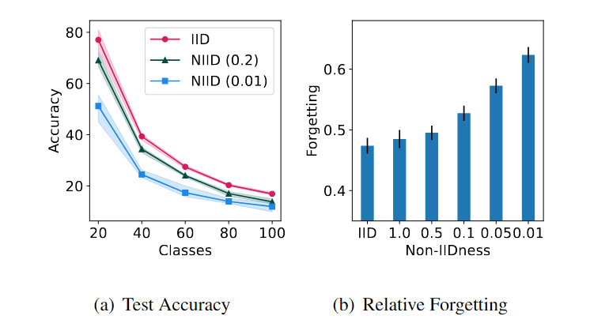
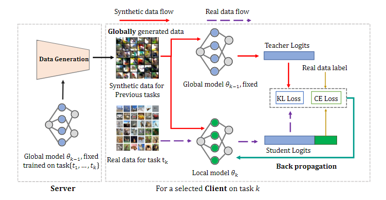
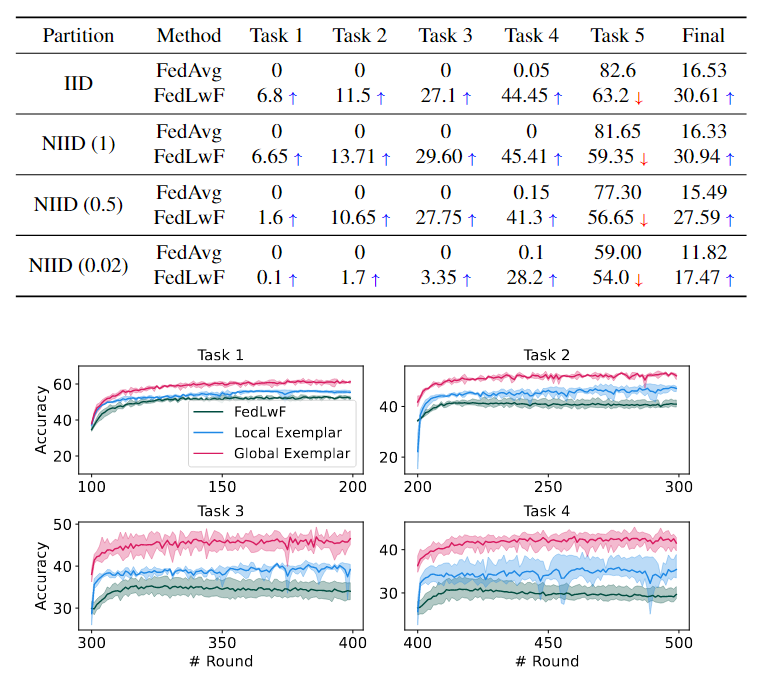
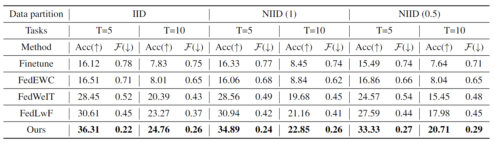

---
authors:
    - mingkun
categories:
    - 深度学习
date: 2024-05-29
tags:
    - Faderated Learning
    - Class -Continual Learning
slug:  "federated-learning-paper1"
---
# TARGET: Federated Class-Continual Learning via Exemplar-Free Distillation

本文关注点是**联邦类持续学习**(FCCL)，其中新类在联邦学习中动态添加。

<!-- more -->

## 综述
**标题**：TARGET: 基于无范例蒸馏的联合类连续学习

**主要贡献**：

1. 证明Non-IID数据加剧了FL的灾难性遗忘。
2. 提出TARGET，减轻FCCL灾难性遗忘的同时，保留了客户端数据隐私。

**优点**：

TARGET不需要任何额外的数据集或存储来自先前任务的真实数据，适用于数据敏感场景。

## 问题背景
传统FL假设静态数据类和域是静态的，而新类可能会出现，数据域在现实中可能随时间变化。

FCCL旨在缓解FL中灾难性遗忘问题，并通过动态添加新类模拟现实场景。其允许本地客户端不断收集新数据，并且可以随时添加新类。

然而，现存FCCL工作往往受限，大多数FCCL方法通过使用额外的数据集或以前的任务数据训练全局模型从而缓解遗忘，但这种方式对客户端数据隐私产生威胁。

本文旨在解决在不存储客户端的本地私有数据或任何额外的数据集的情况下，有效地缓解FCCL中的灾难性遗忘问题。

## 补充定义
### 联邦类持续学习(FCCL)
FCCL专注于FL中新类别学习模型的问题。

FCCL框架由中央服务器和多个客户端组成。所有客户端不与任何其他客户端或中央服务器共享它们的原始数据。每个客户端从 n 个任务序列中学习，其中第 k 个任务包含类 Ck ∈ C 的非重叠子集，其中 C 是所有可能类的集合。

在隐私感知场景中，任务流以未知顺序呈现，每个客户端只能在该任务的训练期间从任务 k 访问其本地数据，此后不再可访问。模型以分布式方式进行训练，其中每一方只能访问类 Ck 的子集（Non-IID）。本文假设每个客户端中数据异构(格式、结构、语义等存在差异)且标签分布倾斜(不同类样本数量分布不平衡)。
### 遗忘问题
客户端仅被授权用当前新任务下的数据更新模型，这通常导致先前任务性能显著下降。一般由网络参数被更新时，先前学习的权重被更新覆盖导致。本文的目标是最小化当前类集 Ck 上的分类错误的同时，最小化先前学习类的变化。

<figure markdown> 
    { width="600" }
    <figcaption>Catastrophic Forgetting</figcaption>
</figure>

目标函数：

$$\min_{\theta_k}\sum_{c\in C_k}\sum_{i=1}^{m_c}L(f_k(x_{i,c};\theta_k),c)+\alpha R(\theta_k,\theta_{k-1})$$

其中 $\theta_k$ 是第 k 轮的模型参数，$L$ 是测量分类错误的损失函数，$R$ 为惩罚先前模型变化的正则化项，$m_c$ 为 c 类中的数据数，$\alpha$为控制正则化强度的超参数，$f_k$ 表示分类模型。$R$ 鼓励当前任务下模型更新参数接近先前参数来防止灾难性遗忘。

### 对遗忘程度的衡量
$$\mathcal{F}_k=\frac1{k-1}\sum_{j=1}^{k-1}f_j^k$$

其中 $F_k$ 表示第 k 个任务的平均遗忘，$f^k_j$ 在模型持续训练到任务 k 之后量化了第 j 个任务的遗忘。具体表示如下：

$$f_j^k=\frac1{|\mathcal{C}^j|}\sum_{c\in\mathcal{C}^j}\max_{t\in\{1,....N-1\}}\left(\mathcal{A}_c^{(n)}-\mathcal{A}_c^{(N)}\right)$$

其中 $C_j$ 是第 j 个任务相关的一组类，A(n) 是第 t 轮 c 类的准确度，$A^{(N)}_c$ 是学习所有任务后 c 类的最终准确度。$f^k_j$ 在学习第 k 个任务后捕获了第 j 个任务的每个类的峰值准确度和最终准确度之间的平均差距。

## 模型建立
<figure markdown> 
    
    <figcaption>TARGET</figcaption>
</figure>

- 利用先前训练的全局模型将旧任务的知识转移到新任务上。
- 训练一个生成器来合成数据，模拟每个客户端的数据分布。

### 服务器端：为旧任务合成数据
给定在任务 $k-1$ 上训练的全局教师模型 $\theta_{k-1}$ ，初始化生成器 $G$ 与学生模型 $\theta_S$，重复：

1. 优化生成器生成符合全局模型分布的数据。
2. 通过合成数据从教师模型中提取知识，更新学生模型。

**生成数据：**
利用 $G$ 从噪声合成数据，最小化交叉熵损失：

$$\mathcal{L}_G^{ce}=CE(\theta_{k-1}(\hat{x}),\hat{y})$$

仅使用CE可能导致 $G$ 过度拟合远离决策边界的数据，为了生成更接近决策边界的数据，引入边界支持损失：

$$
\begin{aligned}&\mathcal{L}_{G}^{div}=-\omega KL(\theta_{k-1}(\hat{x})\theta_{S}(\hat{x})),\text{and}\\&\omega=\mathbb{1}(\arg\max\theta_{k-1}(\hat{x})\neq\arg\max\theta_{S}(\hat{x}))\end{aligned}
$$

KL散度衡量实际分布与理论分布间的差异，通过最大化（?）KL散度损失生成更好的数据。

同时，引入BN稳定数据分布，提高生成器训练稳定性，并在总损失中加入批归一化损失。

$$\mathcal{L}_G^{bn}=\sum_l(||\mu_l(\hat{x})-\mu_l||+||\sigma_l^2(\hat{x})-\sigma_l^2||)$$

总损失如下：

$$\mathcal{L}_G=\mathcal{L}_G^{ce}+\lambda_1\mathcal{L}_G^{div}+\lambda_2\mathcal{L}_G^{bn}$$

**模型蒸馏：**
引入学生模型帮助训练生成器以产生更高多样性的数据，并用训练几轮的生成器的合成数据与教师模型的输出来训练学生模型，使用KL损失进行知识蒸馏。

### 客户端：使用全局信息更新
在客户端，我们可以得到使用前一个任务和当前任务的真实训练数据所合成的数据，然后我们同时训练两个数据集在任务 k 上的局部模型 $\theta_k$。由于使用全局模型和全局数据可以减轻遗忘，我们通过最小化以下目标函数来提取全局教师模型和全局合成数据的知识：

$$\mathcal{L}_{client}=\underbrace{CE(\theta_k(x),y)}_{\text{for current task}}+\alpha\cdot\underbrace{KL(\theta_{k-1}(\hat{x}),\theta_k(\hat{x}))}_{\text{for previous tasks}}$$

## 实验结果
### 灾难性遗忘

<figure markdown> 
    
    <figcaption>Forgetting</figcaption>
</figure>

### 不同程度Non-IID下的表现
<figure markdown> 
    
    <figcaption>Non-IID</figcaption>
</figure>
## 结论

1. 介绍基于无范例蒸馏的联合类连续学习方法。
2. 缓解灾难性遗忘问题。
3. 适合隐私敏感场景。