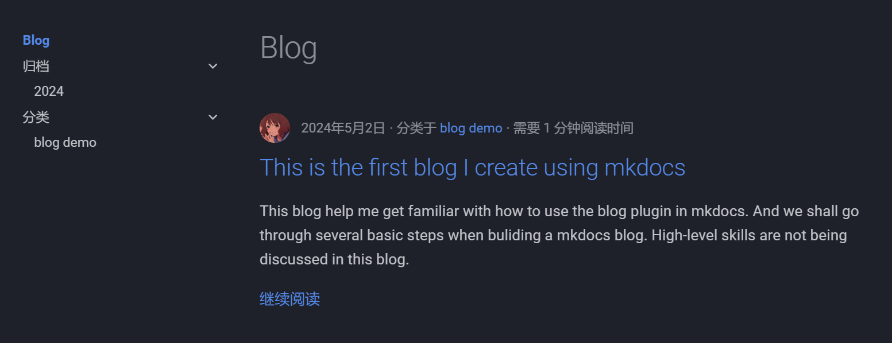
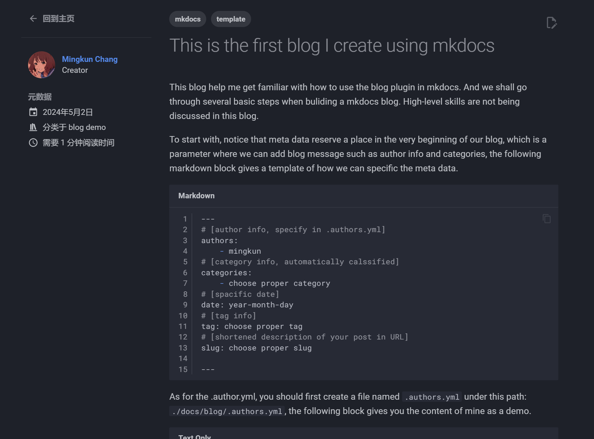

---
authors:
    - mingkun
categories:
    - Mkdocs使用
date: 2024-05-02
tags:
    - mkdocs
    - template
slug:  this-is-a-blog-demo
---
# This is the first blog I create using mkdocs

This blog helps me get familiar with how to use the blog plugin in mkdocs. And we shall go through several basic steps when buliding a mkdocs blog. High-level skills are not being discussed in this blog.

<!-- more -->

## Begin with the metadata

To start with, notice that metadata reserve a place in the very beginning of our blog, which is a parameter where we can add blog message such as author info and categories, the following markdown block gives a template of how we can specific the meta data. 
```markdown
---
# [author info, specify in .authors.yml]
authors: 
    - mingkun
# [category info, automatically calssified]
categories:
    - choose proper category
# [spacific date]
date: year-month-day
# [tag info]
tag: choose proper tag
# [shortened description of your post in URL]
slug: choose proper slug

---
```
As for the .author.yml, you should first create a file named  `.authors.yml` under this path: `./docs/blog/.authors.yml`, the following block gives you the content of mine as a demo.

```
authors:
  mingkun:
    name: Mingkun Chang
    description: Creator
    avatar: https://avatars.githubusercontent.com/u/139034298?v=4
    url: https://github.com/Nijikadesu
```

## A separator can make your blog page cleaner

To be continue, since your artical will be fully presented on the blog page if you didn't add a `<!---more--->` separator, adding a separator can make your blog home page cleaner and easy to access. 

So, don't be hesitate to add a `<!---more--->` separator after the first few paragraphs of your post which you want others to see firstly.

A demo from the [Official Website](https://squidfunk.github.io/mkdocs-material/setup/setting-up-a-blog/#writing-your-first-post) is shown as follows.

```markdown
# Hello world!

Lorem ipsum dolor sit amet, consectetur adipiscing elit. Nulla et euismod
nulla. Curabitur feugiat, tortor non consequat finibus, justo purus auctor
massa, nec semper lorem quam in massa.

<!-- more -->
...
```
## Deal with images

Here are three usual ways you can follow to append images in your webpage.

```
# Method 1
{ align=left }
Image will be shown on the left side.
Content will be shown on the right side.

# Method 2
<figure markdown> 
    { width="300" }
    <figcaption>Image Title</figcaption>
</figure>

# Method 3
{ loading=lazy }
```
## Results display

The blog home page demo and the blog content page demo are shown as follows.

<figure markdown> 
    {align=center}
    <figcaption>blog home page</figcaption>
</figure>


<figure markdown> 
    {align=center}
    <figcaption>blog content page</figcaption>
</figure>

## learn more
Get more infomation and high-level blog building skills from:

[1] [https://squidfunk.github.io/mkdocs-material/setup/setting-up-a-blog/#writing-your-first-post](https://squidfunk.github.io/mkdocs-material/setup/setting-up-a-blog/#writing-your-first-post)

[2] [https://squidfunk.github.io/mkdocs-material/plugins/blog/#usage](https://squidfunk.github.io/mkdocs-material/plugins/blog/#usage)

[3] [https://shafish.cn/blog/mkdocs/#__tabbed_12_3](https://shafish.cn/blog/mkdocs/#__tabbed_12_3)

Thanks for their sharing!