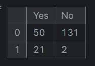
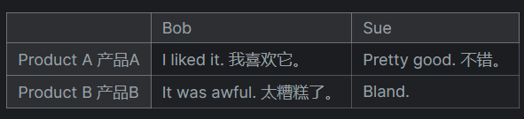
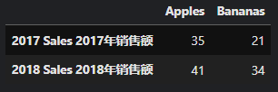
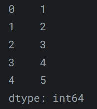
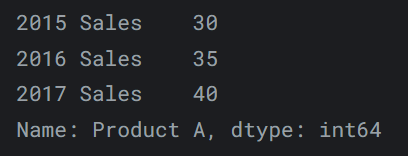
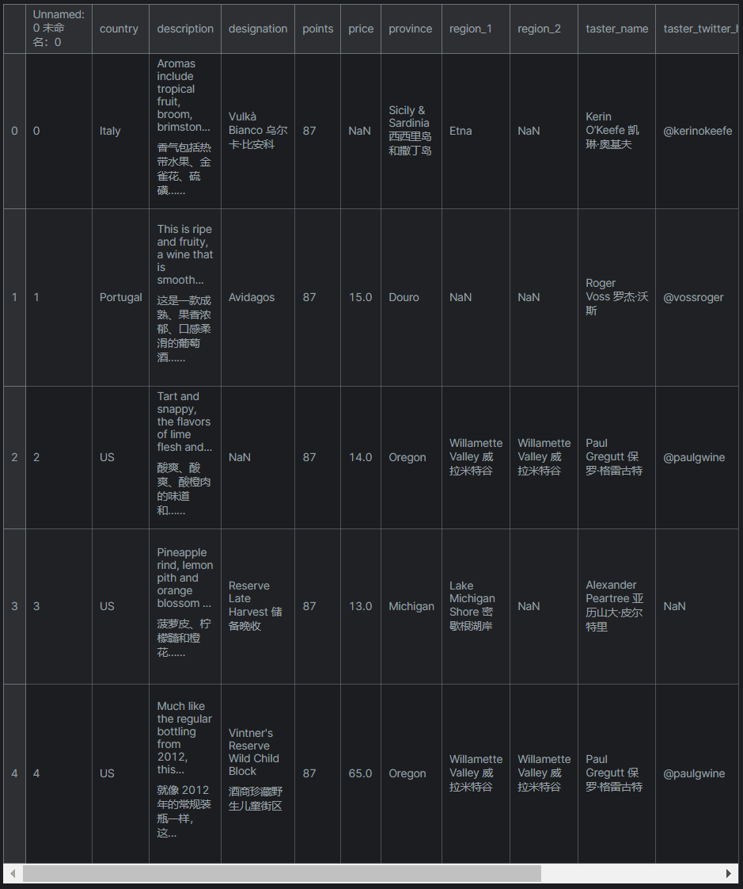

---
authors:
    - mingkun
categories:
    - Pandas教程
date: 2024-05-17
tags:
    - Pandas
slug:  "pandas1"
---

# Pandas Tutorial | 创建，读出与写入

本教程来自kaggle Learn板块，笔者在其Pandas Tutorial基础上做了一些总结补充，并记录在此博客中。

在这篇博客中，我们将学习数据的创建，读出与写入。

<!-- more -->

## 创建数据

### DataFrame | 数据框

DataFrame是一个数据表，它包含一系列单独的条目，每个条目都有特定的值，每个条目对应于一行或一列。

以下给出了一个DataFrame的初始化实例：

```python
pd.DataFrame({'Yes': [50, 21], 'No': [131, 2]})
```
产生如下输出:



DataFrame支持多种数据类型的条目。

我们使用`pd.DataFrame()`构造函数来生成这些DataFrame对象，声明新列的语法是一个字典，其值为条目列表，这是构建DataFrame对象的标准方法。

DataFrame的列标签由初始化参数字典的key值给出，而默认初始化其行标签为从0开始的升序计数。

我们可以通过在构造函数中使用`index`参数为其赋值。

```python
pd.DataFrame({'Bob': ['I like it.', 'It was awful.']
              'Sue': ['Pretty good.', 'Bland.']}, 
              index = ['Product A', 'Product B'])
```

产生如下输出：



我们也可以利用二维列表初始化DataFrame内容，并通过`columns`参数设置DataFrame中的列标签，通过`index`参数设置列标签。

```python
fruits = pd.DataFrame([[30, 21], [41, 34]], columns=['Apples',  'Bananas'],
                      index=['2017 Sales', '2018 Sales'])
```

效果如下：




### Series | 序列

系列是数据值的序列，如果说DataFrame是一个表，那么Series就是一个列表，我们使用`pd.Series()`构造函数生成一个pandas序列，将一个列表作为函数参数。

```python
pd.Series([1, 2, 3, 4, 5])
```

产生如下输出：



本质上，Series是DataFrame的单列，你也可以使用`index`参数将行标签分配给系列，需要注意的是，Series没有列名，它只有一个整体标题`name`

```python
pd.Series([30, 35, 40], index=['2015 Sales', '2016 Sales', '2017 Sales'],
          name='Product A')
```

产生如下输出：



Series与DataFrame密切相关，可以将DataFrame视为一堆粘在一起的Series。

### Reading data files | 读取数据文件

最基本也是最简单的数据存储文件为**CSV文件**，由于其文件内容由逗号分隔，便称为逗号分隔值文件 ("Comma-Separated Values" or CSV)。

我们使用'pd.read_csv()'函数将文件数据读入DataFrame。

```python
wine_reviews = pd.read_csv("../input/wine-reviews/winemag-data-130k-v2.csv")
```

我们使用`shape`属性检查创建的DataFrame的大小。

```python
wine_reviews.shape
# outputs:
# (129971, 14)
```

我们使用`head()`命令检查生成的DataFrame的内容，该命令获取DataFrame
的前五行信息。

```python
wine_reviews.head()
```

效果如下：



从上图中我们可以看到，在country和DataFrame索引之间存在一列`未命名`索引，这是CSV文件的内置索引，CSV文件在被读入到DataFrame中时， Pandas不会自动获取该索引，我们可以通过`index_col`参数指定内置索引作为DataFrame的索引值。

```pythond
wine_reviews = pd.read_csv("../input/wine-reviews/winemag-data-130k-v2.csv",
                           index_col = 0)
```

此时，当我们再次运行`wine_reviews.head()`，会发现上图中的`未命名`索引不再出现。

### Save DataFrames as CSV files | 保存为CSV文件

我们使用`pd.to_csv()`将DataFrame保存为CSV文件，参数为文件名，保存在当前程序文件的同级文件夹下。

```python
wine_reviews.to_csv("wine_reviews_new.csv")
```