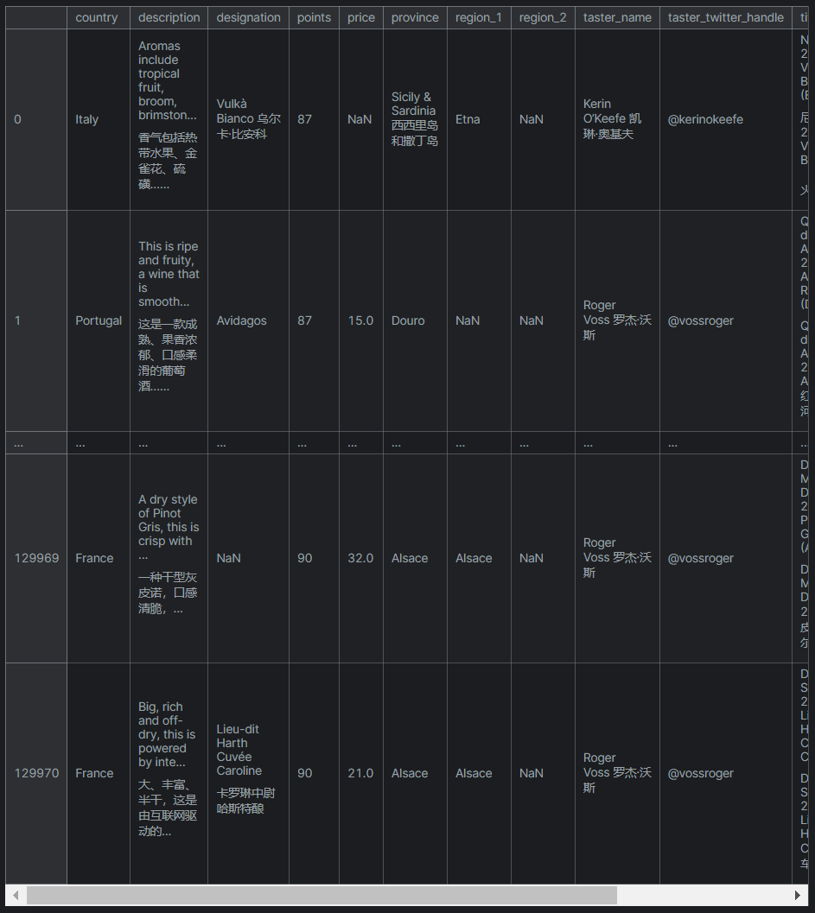
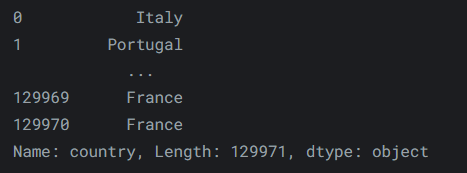
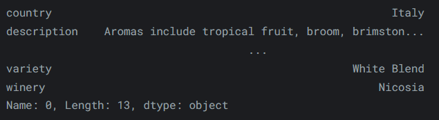
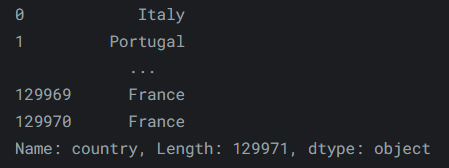
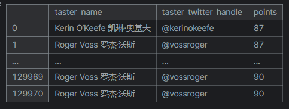
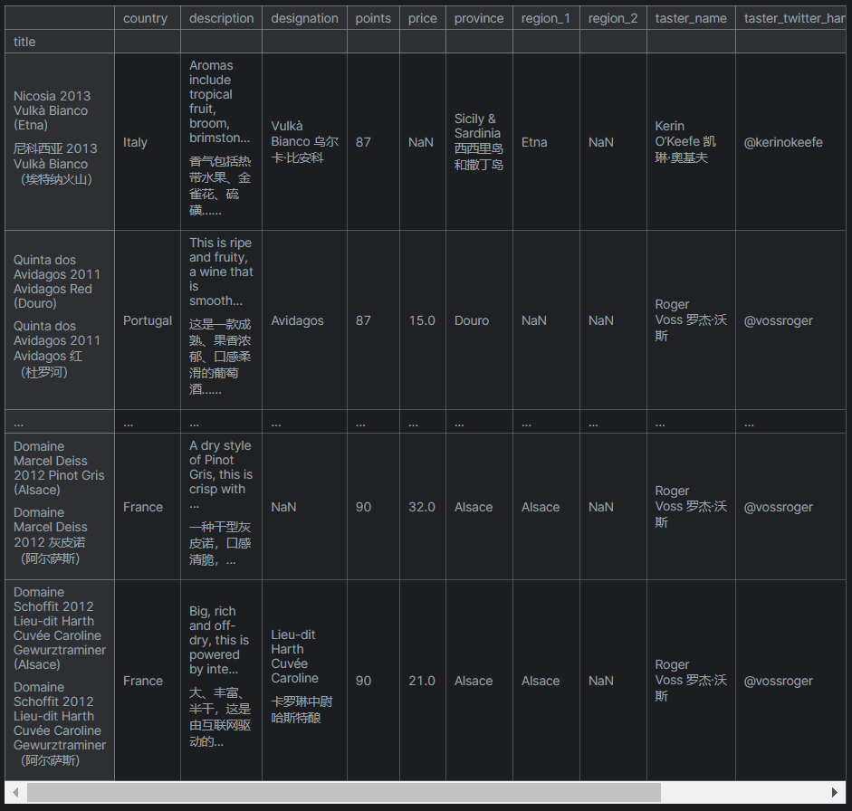
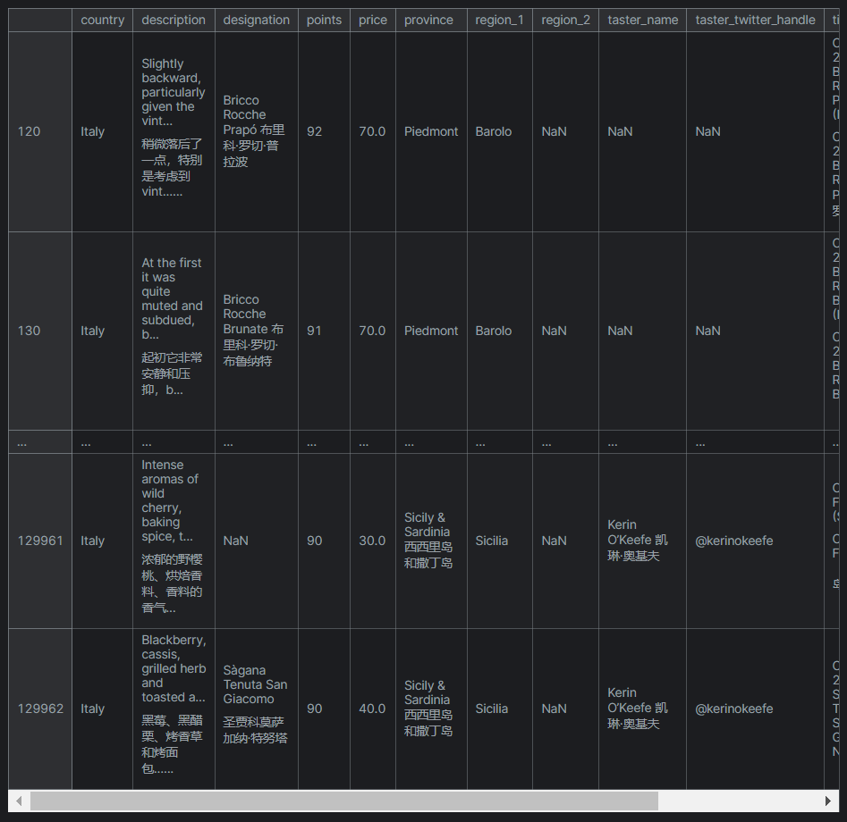

---
authors:
    - mingkun
categories:
    - Pandas教程
date: 2024-05-17
tags:
    - Pandas
slug:  "pandas2"
---

# Pandas Tutorial | 索引，选择与分配

本教程来自kaggle Learn板块，笔者在其Pandas Tutorial基础上做了一些总结补充，并记录在此博客中。

在这篇博客中，我们将学习数据的索引，选择与分配。

<!-- more -->

## Native accessors | 本地访问器

在Python中，我们可以通过将对象的属性作为属性来访问它，例如一个`book`对象可能具有`title`属性，则我们通过`book.title`可以对其进行访问，DataFrame也具有类似的工作方式。

我们可以通过`.`访问DataFrame的列属性。

考虑如下DataFrame：



要访问`reviews`的`country`属性，我们可以：

```python
reviews.country
```

效果如下：



我们也可以通过索引运算符`[]`访问它的值，并取得与上图相同的结果：

```python
reviews['country']
```

我们可以再次通过索引运算符`[]`深入到某一列的特定行。

```python
reviews['country'][0]
# outputs:
#   'Italy'
```

## Indexing in pandas | Pandas索引

### 基于索引的选择
                                                                
我们使用`pd.iloc`来通过数据在数据表中的坐标位置来选择数据。

例如，我们可以通过如下方法获取DataFrame中的第一行数据：

```python
reviews.iloc[0]
```

效果如下：



可以发现，与DataFrame的索引方式不同，`pd.loc`遵循**行有限于列**的索引规则，下文将要提到的`pd.iloc`同样遵循此规则。

因此，如果我们想要获取DataFrame中的第一列数据，我们可以：

```python
reviews.iloc[:, 0]
```



从单列切片的打印结果中可以发现，列标题是作为该切片的`name`属性存在的，这印证了我们在第一篇博客中的论点，即DataFrame可以看成一系列粘合的Series。

上文中，`:`运算符用于指示值的范围，在`pd.iloc`中，它遵循**左闭右开**的原则，而在下文将要提到的`pd.loc`中，它遵循**全闭**的原则，下面给出示例：

```python
# 对第一列的前三行进行切片
reviews.iloc[:3, 0]

# 对第一列的第二行和第三行进行切片
reviews.iloc[1:3, 0]

# 也可以传递一个列表，指定要进行切片操作的行/列
reviews.iloc[[1, 2, 3], 0]

# 支持复数索引
reviews.iloc[-5:, 0]
```

### 基于标签的选择
我们使用`pd.loc`来通过标签名索引值，而不是位置。

要获取reviews中的第一个条目，可以执行以下操作：

```python
reviews.loc[0, 'country']
# outputs
#   'Italy'
```

当你的数据集具有某些有意义的索引时，利用`loc`操作会使检索过程变得容易。

例如：

```python
reviews.loc[:, ['taster_name', 'taster_twitter_handle', 'points']]
```

效果如下：



### 操作索引

我们可以使用`pd.set_index()`来为当前DataFrame重新设置索引，且新索引为当前已经存在的数据列。

比如，我们想将`reviews`中的`title`列设置为新数据表的索引：

```python
reviews.set_index("title")
```

效果如下：



### 条件选择

为了利用数据做更有趣的事情，我们经常需要根据条件提出问题。

比如，我们对意大利生产的优于平均水平的葡萄酒特别感兴趣：

```python
reviews.loc[reviews.country == 'Italy']
```

效果：


我们想要查看其中评分大于等于90分的葡萄酒，这就涉及到逻辑计算的操作，我们可以通过`&`来表示逻辑合取，通过`|`来表示逻辑析取：

```python
reviews.loc[(reviews.country == 'Italy') & (reviews.points >= 90)]
```

结果如下：



注意，在写条件判断式时，千万注意加括号，否则你会发现输出的DataFrame切片里啥也没有（原因自己想）。

我们还可以利用内置的条件选择器`isin()`实现条件选择语句的简化，比如我们想选择来自意大利或法国的葡萄酒，以下的两个表达式均导向相同且正确的结果：

```python
# 1
reviews.loc[reviews.countries.isin(['Italy', 'France'])]
# 2
reveiws.loc[(reviews.countries == 'Italy') | (reviews.countries == 'France')]
```

我们还可以通过`isnull`/`notnull`选择空/非空的值（NAN）。

```python
reviews.loc(reviews.price.isnull())
reviews.loc(reviews.price.notnull())
```

### 分配数据

我们可以直接利用索引新建列并分配静态/可迭代数据。
```python
reviews['critics'] = 'everyone'
```